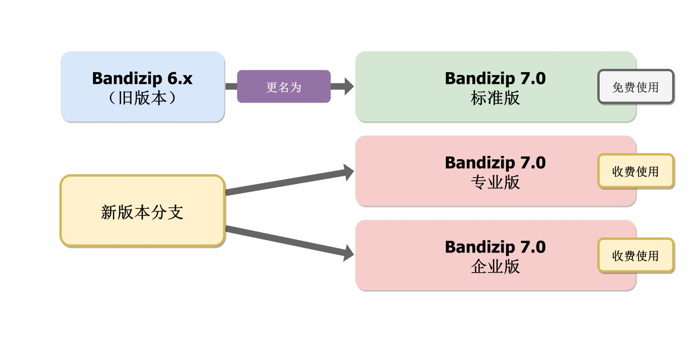

# ✨Bandizip

官方网站：[Bandisoft - Bandizip, Honeycam, Honeyview](http://www.bandisoft.com/)

 

# ✨Bandizip 7.X 版本说明

Bandizip 7.X 起分为标准版、专业版、企业版

标准版含有广告

[Bandizip 7.0 History (bandisoft.com)](http://www.bandisoft.com/bandizip/history/7.0/)

## New license system

Bandizip 7.0 is released in 3 types of editions: Standard (Free) / Professional (Paid) / Enterprise (Paid)

- Standard Edition: Free of charge, available for commercial and non-commercial use, some features limited.
- Professional Edition: Sold to individual users.
- Enterprise Edition: Sold to enterprise users.

 

Bandizip各版本详细功能比较如下

[Bandizip - Bandizip 各版本功能对比 (bandisoft.com)](http://cn.bandisoft.com/bandizip/help/edition-comparison/)

 

# ✨Bandizip 6.X

Bandizip历史版本

免费无广告。

 

# ✨Git仓库各版本安装包文件说明

## BANDIZIP6-SETUP.EXE

此安装包为Bandizip 6.29

也可以通过如下方式从Bandizip官方网站获取

 

访问 [Bandizip - 下载 Bandizip 6.x (bandisoft.com)](https://www.bandisoft.com/bandizip/old/6/) 点击 [Download Bandizip 6.29 »](https://www.bandisoft.com/bandizip/dl.php?old)

## BANDIZIP6-PORTABLE.zip

此安装包为Bandizip 6.29（便携版）

 

## BANDIZIP-SETUP.EXE

此安装包为Bandizip 6.26

 

## BANDIZIP5-SETUP-GL.EXE

此安装包为Bandizip 5.23（适用于Windows XP的旧版）

也可以通过如下方式从Bandizip官方网站获取

 

[适用于 Windows XP 的旧版 Bandizip (bandisoft.com)](http://cn.bandisoft.com/bandizip/old/)

以下为Bandizip 5.23页面 已测试下载后非中文版

本仓库中的安装包为中文版

 

# ✨Bandzip历史版本下载

GitHub：

https://github.com/FlatWhite233/bandizip-6.x

Gitee：

https://gitee.com/Flat-White/bandizip-6.x
